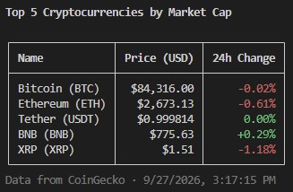

# coin-cli

A small command-line tool that fetches the top cryptocurrencies by market cap
from the [CoinGecko API](https://docs.coingecko.com/reference/coins-markets)
and prints them as a table in your terminal: name, current price and 24-hour
change. Gains are shown in green, losses in red.

<u>Example output running the script</u>



## Requirements

- **Node.js 18 or newer** — the tool uses the built-in `fetch`, so no HTTP
  library is needed.
- An internet connection. No API key is required; it uses CoinGecko's free
  public endpoint.

## Installation

There are no dependencies to install. Clone or download the project and run it:

```bash
cd coin-cli
node index.js
```

`npm install` is optional and installs nothing.

## Usage

```bash
node index.js          # top 5 (default)
node index.js 10       # top 10
node index.js 250      # top 250 (the maximum CoinGecko returns per request)

npm start              # same as node index.js
npm start -- 10        # note the -- before the number
```

### Parameters

| Parameter | Required | Default | Description                                    |
| --------- | -------- | ------- | ---------------------------------------------- |
| `count`   | No       | `5`     | How many coins to show. A whole number, 1–250. |

Anything else — a word, a decimal, zero or a number above 250 — prints an error
and exits with code 1 without calling the API.

## Configuration

Edit [`src/config.js`](src/config.js) to change the defaults:

| Setting         | Default | Description                                  |
| --------------- | ------- | -------------------------------------------- |
| `CURRENCY`      | `usd`   | Any currency CoinGecko supports, e.g. `eur`. |
| `DEFAULT_LIMIT` | `5`     | Coins shown when no count is passed.         |
| `MAX_LIMIT`     | `250`   | Highest count accepted.                      |

The price column header follows `CURRENCY`, so it stays correct if you change
it.

## Architecture

Each module has one job, and data flows in one direction:

```
CLI args ─▶ args.js ─▶ index.js ─▶ api.js ─▶ CoinGecko
                          │
                          ├─▶ format.js ─▶ display-ready rows
                          └─▶ table.js  ─▶ printed table
```

| File                              | Responsibility                                                                             |
| --------------------------------- | ------------------------------------------------------------------------------------------ |
| [`index.js`](index.js)            | Entry point. Reads the argument, calls the API, prints the table, handles errors.           |
| [`src/args.js`](src/args.js)      | `parseLimit(args)` — validates the coin count from the command line.                        |
| [`src/api.js`](src/api.js)        | `fetchTopCoins({ limit, currency })` — the CoinGecko request. Throws on a failed response.  |
| [`src/format.js`](src/format.js)  | `formatPrice`, `formatChange`, `formatCoin` — raw API data to display text plus its color.  |
| [`src/table.js`](src/table.js)    | `renderTable(columns, rows)` — draws the box table. Knows nothing about coins.              |
| [`src/colors.js`](src/colors.js)  | ANSI color codes and a `colorize(text, color)` helper.                                      |
| [`src/config.js`](src/config.js)  | Settings: currency and coin-count limits.                                                   |

Notable details:

- **Prices under $1 get up to 6 decimals**, so stablecoins and micro-cap coins
  still show meaningful digits. Everything else gets 2.
- **Columns size themselves** to their longest value, and padding is applied
  before the color codes so the borders line up.
- **Missing values** from the API print as a dim `N/A` rather than breaking the
  table.
- **Errors** — bad input, HTTP failures such as rate limiting, and network
  problems — print one red line and set exit code 1.

## Notes

CoinGecko's free API is rate-limited. Running the tool many times in quick
succession may return HTTP 429; the tool reports this as a clean error message.

A record of how the project was built is in
[`context/sessions.md`](context/sessions.md).
